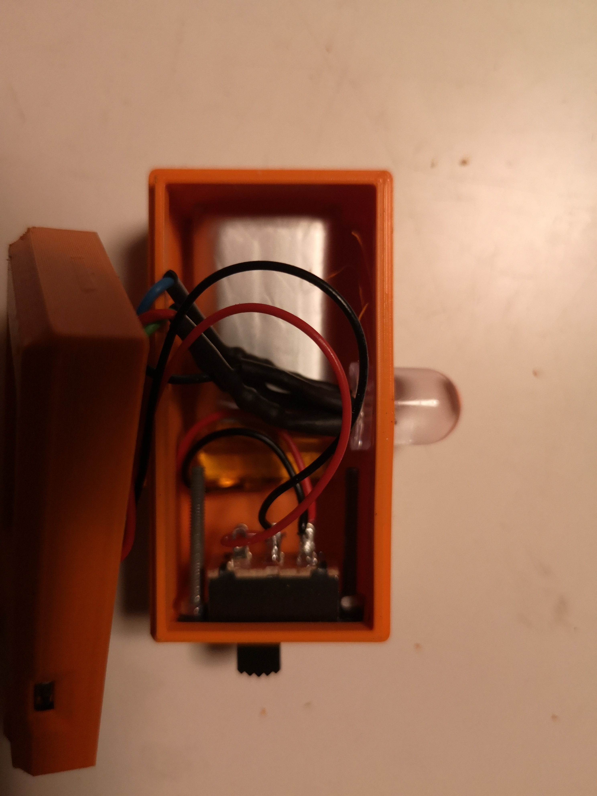
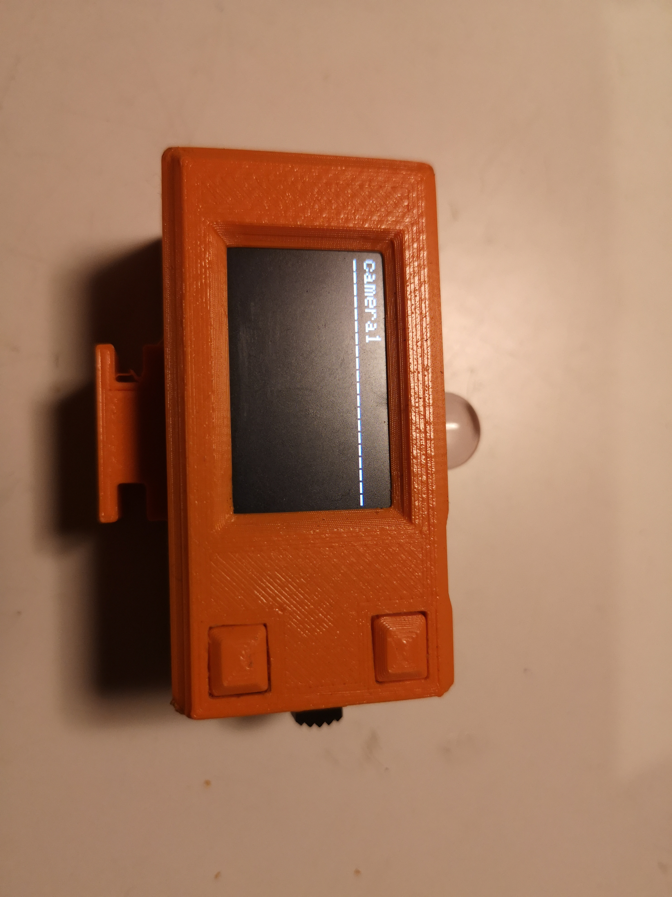

# Tally Arbiter TTGO_T Listener

Tally Arbiter TTGO_T Listener is a modified Version of the Tally Arbiter M5Stick-C Listener, written by Joseph Adams (https://github.com/josephdadams/TallyArbiter/tree/master/listener_clients/m5stickc-listener), with support for a TTGO_T-Display device.

To learn more about the Tally Arbiter project, [click here](http://github.com/josephdadams/tallyarbiter).

It is not sold, authorized, or associated with any other company or product.

To [report a bug](https://github.com/josephdadams/TallyArbiter/issues/new?assignees=JTF4&labels=bug&template=bug.yaml&title=%5BBug%5D%3A+) or open a [feature request](https://github.com/josephdadams/TallyArbiter/issues/new?assignees=JTF4&labels=feature&template=feature.yaml&title=%5BFeature+Request%5D%3A+), please go to our [issues](https://github.com/josephdadams/TallyArbiter/issues/new/choose) page.
If you would like to see more of @josephdadams's projects or send a word of encouragement his way, please visit [techministry.blog](https://techministry.blog/).

## Assembling the device

I have added a 3 color LED (connected with 3x 270 Ohm resistors) and an on/off switch for the battery.
The backlight can be switch on or off with the lower button.
The battery is an 800mAh lithium cell.  
When Voltage drops under 2.8V, it goes into sleep mode. Restart with top button.  
Hold top button when startup, put it in setting mode.

For the case I used the front panel of pjmi on Thingiverse: https://www.thingiverse.com/thing:4501444  
The back case is redesigned for holding a 10mm 3 color led, a battery and a camera shoe mount.

## Installing Sketch and Libraries

1. Follow the tutorial for your specific ESP32-board to download, install, and configure the Arduino IDE program. This is necessary to compile the code for your device.
1. Once you have the Arduino IDE installed and configured for your OS, install the following libraries (if not already installed):
   - `Adafruit_NeoPixel` by Adafruit (depending on the device you are using)
   - `WebSockets` by Markus Sattler
   - `Arduino_JSON` by Arduino
   - `TFT_eSPI`

These will have to be included with the sketch file in order for it to compile properly.

## Compile and Upload the Sketch to the Device

1. Once all libraries are downloaded, open the `TTGO_T-listener.ino` file in the Arduino IDE.
2. Connect your ESP32 device to the computer via the provided USB-C or micro-USB cable.
3. If not already on, power the device on by holding down the power button (located on the bottom left-hand side) for a couple seconds.
4. Go to Tools > Board > ESP32 Arduino > and choose the right ESP32 based on the board you have.
5. Go to Tools > Port > and choose the serial port that represents your device.
6. Go to Sketch > and choose `Upload`. The code will compile and upload to the device.

Once the code is successfully compiled and uploaded to the device. the ESP32 will boot up and automatically try to connect to your Tally Arbiter server. It will auto-assign itself to the first Device on the server, and you can reassign it through the Settings GUI of Tally Arbiter.

Video Walkthrough (for the M5Stick-C, not for this kind of devices): https://youtu.be/WMrRKD63Jrw

# Use case

I installed TallyArbiter on a pi. For the correct versions of node I used https://github.com/audstanley/NodeJs-Raspberry-Pi.

For starting TallyArbiter at boot, I put these 4 lines in /etc/rc.local.
(
cd /home/pi/tallyarbiter
node /home/pi/tallyarbiter/index.js &
)
pm2 didn't work for me.

# Improvements and Suggestions

We are welcome to improvements and suggestions.
Feel free to contact us on Github Discussions or open a PR.

## Thanks

Thank you to peterfdej for this listener client!
